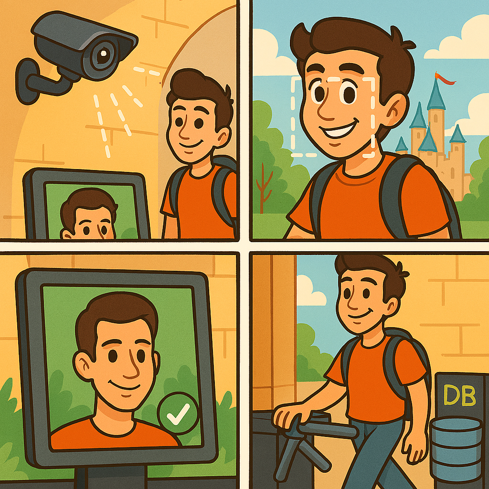

# Face Recognition Web App

This project is a simple face recognition web application built with the following technologies:

- **Spring Boot**: Provides the backend REST API and web server.
- **Java 25**: The application is developed using Java 25 for modern language features and performance.
- **Haarcascade**: Uses OpenCV's Haarcascade classifier for face detection (`haarcascade_frontalface_default.xml`).
- **Facenet**: Employs the Facenet deep learning model (`openface.nn4.small2.v1.t7`) for extracting face embeddings.
- **JavaCV/OpenCV**: Integrates JavaCV and OpenCV for image processing and face detection/recognition tasks.

## How it works
1. The web UI allows users to register and re-enter by capturing their face image (camera or upload).
2. The backend detects faces using Haarcascade and extracts embeddings using Facenet.
3. Face embeddings are stored and compared for recognition.

## Model Sources
- Facenet model: https://github.com/pyannote/pyannote-data/blob/master/openface.nn4.small2.v1.t7
- Haarcascade file: https://github.com/opencv/opencv/tree/master/data/haarcascades/haarcascade_frontalface_default.xml

## Illustrations

